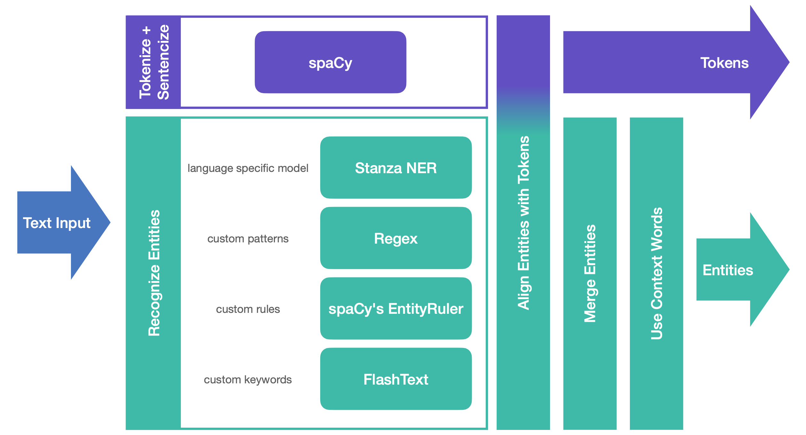

# NERwhal

**A multi-lingual suite for named-entity recognition in Python.**

---


[](http://opensource.org/licenses/MIT)
[](https://github.com/ambv/black)

_**:warning: Disclaimer :warning::**_ This is a prototype. Do not use for anything critical.

## Description

NERwhal's mission is to make defining custom recognizers for different NER approaches as easy as possible.
To achieve this, different NER backends are implemented behind a unified API.
Each recognizer is based on one of the backends.
Users can detect named entities by implementing custom recognizers for one or more of the backends.

Check out our blog post about NERwhal on [Medium](https://medium.com/@openredact/nerwhal-a-multi-lingual-suite-for-named-entity-recognition-d3ac6beb547?source=friends_link&sk=24ad2960999523d371c2155bef10b60c).

### Powerful NER backends

NERwhal makes use of some of the most powerful NER platforms out there:
- Regular expressions: Using [regular expressions](https://docs.python.org/3/library/re.html) you can define a named entity as a set of strings.
- Entity Ruler: [spaCy’s](https://spacy.io/) [Entity Ruler](https://spacy.io/usage/rule-based-matching#entityruler) lets you define patterns for sequences of tokens. ([spaCy](https://spacy.io/) is also used for tokenization)
- FlashText: The [FlashText Algorithm](https://arxiv.org/abs/1711.00046) can search texts very efficiently for long lists of keywords.
- Deep Learning: The [Stanza](https://stanfordnlp.github.io/stanza/) library and models (which provide [state-of-the-art results for NER](https://arxiv.org/pdf/2003.07082.pdf) in many languages) power NERwhal's statistical recognition. Currently, Stanza supports NER for 8 languages.

### Smart combination of the results

The suite can combine the results of these methods in a smart way to get best results.
E.g. a match with a higher score can overwrite a lower scored one, or, if one entity was identified several times, its confidence score can be increased.

### Context words

Each recognizer can define a list of context words that may occur in the context of named entities.
If a context word is found in the same sentence as the entity, the confidence score is increased.



## Integrated recognizers

NERwhal follows the philosophy that recognizers are specific to the language, use case, and requirements.
The recommended way to use is to define your own custom recognizers.
Yet to exemplify its usage and to help you bootstrap your own recognition suite, some example recognizers are implemented in [nerwhal/integrated_recognizers](nerwhal/integrated_recognizers).
Please refer to each recognizers' PyDoc for more information, and keep in mind that none of these recognizers will catch all occurrences of their category, and that they may produce false positives results.


## Usage

To recognize named entities, pass a text and config object to the `recognize` method.
Select the recognizers to be used in the config object.

```python
>>> from nerwhal import recognize, Config
>>>
>>> config = Config(language="de", use_statistical_ner=True, recognizer_paths=["nerwhal/integrated_recognizers/email_recognizer.py"])
>>>
>>> recognize("Ich heiße Luke und meine E-Mail ist luke@skywalker.com.", config=config, return_tokens=True)
{
    'tokens': [
        Token(text='Ich', has_ws=True, br_count=0, start_char=0, end_char=3),
        Token(text='heiße', has_ws=True, br_count=0, start_char=4, end_char=9),
        ...
        Token(text='.', has_ws=False, br_count=0, start_char=54, end_char=55)
    ],
    'ents': [
        NamedEntity(start_char=10, end_char=14, tag='PER', text='Luke', score=0.8, recognizer='StanzaNerBackend', start_tok=2, end_tok=3),
        NamedEntity(start_char=36, end_char=54, tag='EMAIL', text='luke@skywalker.com', score=0.95, recognizer='EmailRecognizer', start_tok=7, end_tok=8)
    ]
}
```

### Implementing custom recognizers

To implement a custom recognizer, you have to implement one of the interfaces in [recognizer_bases](nerwhal/recognizer_bases).
For examples see one of the [integrated_recognizers](nerwhal/integrated_recognizers).


## Development

### Install requirements

You can install all (production and development) requirements using:

```
pip install -r requirements.txt
```

### Install the pre-commit hooks

This repository uses git hooks to validate code quality and formatting.

```
pre-commit install
git config --bool flake8.strict true  # Makes the commit fail if flake8 reports an error
```

To run the hooks:
```
pre-commit run --all-files
```

### Testing

Run all tests with:
```
pytest --cov-report term --cov=nerwhal
```

To skip tests that require the download of Stanza models run:
```
pytest -m "not stanza"
```

## How to contact us

For usage questions, bugs, or suggestions please file a Github issue.
If you would like to contribute or have other questions please email hello@openredact.org.

## License

[MIT License](https://github.com/openredact/nerwhal/blob/master/LICENSE)
